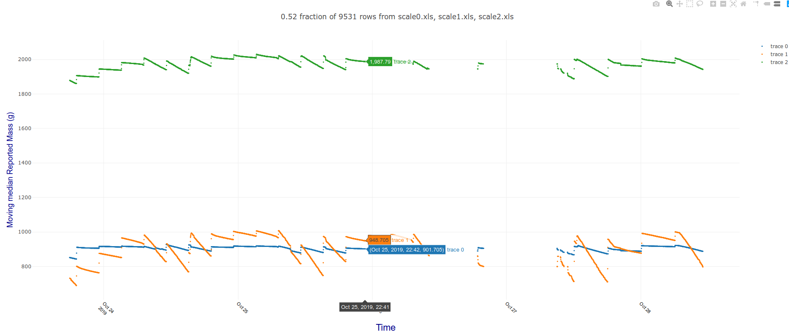

*Project goal* 

Evaluate **biomass growth rate** as a dependent variable for experiments with environmental factors including nutrition and lighting to 
improve hydroponic crop yields and efficiency, using inexpensive commodity hardware and the software in this repository.

*What we are trying to measure?*

One major aim is to gather data that tracks a plant's weight gain over time so the rate of change in biomass can be estimated.

In order to estimate the rate of change, an uninterrupted time series of instantaneous weight measurements will be collected from a load cell 
positioned underneath the pot. Sampling every 30 seconds seems to give reasonable detail without being too unwieldy.

All plants are in hydroponic ("hempy") pots so all nutrients are supplied in the watering solution. This avoids dealing with the inevitable loss of mass
expected as soil became depleted of soluble nutrients over the growing period. 

Note that the total mass at any time includes *a fixed component* comprising the pot plus the water free medium, plus *some variable 
components*:

* the growing plant biomass

* the mass of water held in the hydroponic medium 

* the mass of water in any reservoir

We are trying to measure only the first one, but will need to take account of all other variable sources of change.

*Central assumption*

It seems reasonable to assume *that any real change in the total mass* can only arise from:

* real change in plant biomass and/or 

* real change in the mass of water in the pot from an automated timed watering event, manual watering or from loss due to plant transpiration or other evaporation.

Measurement as always, is complicated by technical, systematic and random errors. 

*What technical measurement issues can be expected*

Random error is inevitable in any physical measurement, including:

* Accidental physical contact of plants, PVC tubes or pots during maintenance. It's almost impossible to avoid bumping the scales or plants when viewing them and 
handling them during maintenance such as when scouting for pests with a loupe, pruning or manually watering. No attempt will be made to avoid these necessary 
interventions since this is a proof of concept. *If it works, it will work even better under more strictly controlled conditions.*

* Pots have two PVC irrigation pipes fixed to them. The bottom, larger (10mm) one is for drainage into containers and the other smaller (7mm) carries fluid 
from the automated nutrient pump attached to the nutrient reservoir. These pipes can and do interfere with measurement if/when they bump into each other or into 
other equipment in the growing space. 

* The electronic hardware. The load cell and A/D converter chip introduce their own systematic and random errors, but from earlier experiments, these seem to be minimised by
leaving the HX711 powered down most of the time between samples and using the 3.7v supply instead of the more usual 5V to minimise chip and circuit heat. 

In addition to *random error and real changes in plant biomass*, there are important *systematic* sources of variation that must
be dealt with in analysis:

* Automated watering. Each pot receives a few hundred millilitres of nutrient solution over a minute or so, several (typically 4) times a day. The pot + plant will
be at the maximum possible mass when it is freshly watered if the watering has produced substantial run off into the drainage system, because the medium will be saturated and the perlite
reservoir of the hempy pot will be full. This suggests that one possible approach for estimating growth in each series *as the slope between successive maximum mass 
values after regular watering*.

* Defoliation. Plants are regularly defoliated so leaves are removed from the plant biomass periodically. Senescent and damaged leaves are always removed. 
Routine defoliation is practised to shape and control the plants growth to suit the limited space available. A moderate defoliation will remove about 10g of fresh biomass 
from one plant in one session. The effect was easy to see in the first test days as a decrease from one maximum to
the next. Since this defoliation is a normal part of plant management, one way of avoiding bias will be to test each pair of maxima from each series for downward 
discontinuities at some arbitrary (eg 10g) threshold. These signify that a scale change after defoliation has occurred. If we use these discontinuities to divide the 
series maxima into groups of steadily increasing maxima, each used to estimate a growth slope. Between discontinuities of loss of biomass, 
*Slope between successive increasing maxima* should give a useful estimate of biomass gain over time and the 
discontinuities should not bias the estimates as long as they are accounted for in the analysis as a way to partition periods between episodes of biomass removal
for slope estimation. Defoliation usually occurs no more than once every few days so there should be at least 4 peaks (24 hours of watering every 6 hours) in each
estimate of growth rate. Many will be much longer between defoliation episodes.

* Cheap kit. Cheap loadcells are notoriously temperature sensitive and have a bad press for instability. Months of continuous data are needed so regular re-tare of the scales is
impracticable. In order to get a clear understanding of how bad these systemic and random sources of variation are, one scale has a 4kg mass instead of a plant pot and the range 
of variability appears to be within 4g over 6 days of observation, so ~0.1% "error". That's arguably good enough for government work since the plants 
under test are currently transpiring 10-50g/hour each during lights-on.

Summary of measurement technical issues:

**Random variation is unavoidable and adds "noise". It's not so bad if it's unbiased which ours probably is so we essentially ignore it. Systematic variation is more or less fixed and consistent 
within each load cell/plant series and seem unlikely to make much difference to the estimate of growth based on the slope between successive watering time maximum weights** 

*Components*

1. The protype hardware comprises a Raspberry pi zero w attached to 4 hx711 A/D chips each wired to a 10kg load cell - cheap no-name, documentation free chinese kit from ebay.
It's a fugly mess of (labelled!) wires and plugs but it's mine and it works fine.

* The loadcells have HX711 A/D converter chips and each one uses 2 GPIO ports for clock and data. The zero can easily run 4 of them sampling at
30 second intervals or so - set as SAMPINT in config.py. Much faster sampling would require a faster CPU. 

* Cheap chinese ebay gear - about $20 delivered for 4 loadcell/HX711 kits, so poor data was expected. So far, I have been pleasantly surprised. From my experiments, it's a good idea to 
power down the HX711 between readings and with my chips, use 3.7v rather than the 5v supply because heat may lead to horrible drift as has lead previous projects like the beekeeper one to
abandon load cells. 

* The load cells must be mounted on rigid plates to be useful. I hacked some pine fencing. The aluminium load cells have threaded holes for bolts. One pair for #4 and one for #5,
probably to help ensure that the load cells are mounted the right way up in application. Standoffs are essential so the load cell does not ever touch a plate directly, even under load.
(make sure each bolt goes through 2 washers that are compressed between the load cell and the plate.

* Wiring the load cells to the HX711 chips involves correctly soldering some rather small things and making good decisions about which wire goes where.
Labels and Google for documentation (since none comes with the cheap chinese kit) are essential for sanity. 
This is definitely not an ideal choice as a first project since without excellent vision, steady hands, a reliable tiny soldering iron
and extensive small-thing soldering skills, it's very easy to cook a chip or make messy short circuits. Should be good by about the third one I reckon so buy some spares.

* The rpi runs some python code as a service after an initial interactive run when each scale is tared and calibrated with a known weight. Calibrations are
reused each time the raspberry pi starts the service until the next calibration is performed interactively. The code takes weight readings from multiple load cells 
periodically and posts them to my fileserver using SFTP, where the Flask webapp code can read and plot them interactively. 

* Dependencies for the raspberry pi code include the paramiko, HX711 and Rpy.GPIO python modules. Please, use a virtual environment for the server but if
you only use the pi zero for this project, installing to the system python environment seems reasonable. 
Something like:

> sudo pip3 install hx711
> sudo pip3 install RPi.GPIO
> sudo pip3 install paramiko

should work.

2. SFTP accessible server for file storage

* In order to avoid regular aggravation from hard failed SD cards, it's best not to be writing regularly to local storage, so data are all exported to a file server via sftp. 
In my case it's all on my firewalled LAN but...YMMV 
 
* config.py contains all the login and path details. Suggest you supply a public key file path rather than a password especially if you are going full interweb.

3. Data analysis and presentation

* There's an interactive web "dash in flask" application in this repository based on a project described at the head of this file). 

* One component is a simple plotter for our data. All data series at the config.py path will be available for plotting. 

* The web server component of this project is based on the fine code found at *"Dash on flask with flask_login
An example of a seamless integration of a Dash app into an existing Flask app based on the application factory pattern.
For details and how to use, please read: https://medium.com/@olegkomarov_77860/how-to-embed-a-dash-app-into-an-existing-flask-app-ea05d7a2210b"*

* requirements.txt contains a long list of dependencies. In the python virtual environment you use for this project,
> pip3 install -f requirements.txt 
should do the needful.

* Plots can be configured to use raw measured mass data. Most of my series have widely different dynamic ranges of mass over time. There are bigger and smaller pots, and 
plant phenotypes with bigger or smaller water use. In this case, mean centering is a really good idea to make more than one plot comparable. 
Mean centering only changes the Y scale but otherwise makes no difference to the shape of each series. It certainly does 
make multiple series with variable dynamic ranges much easier to compare because the Y axis range is smaller compared to a non-centered multiple series plot, 
where a larger Y axis range results in a lot of fine detail being lost in each individual series.

* These plots are interactive and that becomes silly slow with big data. A month will be about 3000*30=90000 data points. No point plotting them all when a random sample
of say, 5000 points from each series will give excellent fidelity with reasonable interactivity. Repeating a plot may give a rather different appearance using down-sampled raw data.
Outliers vary in each sample, and the Y axis scale automatically adapts to accomodate the most extreme high and low outliers. Outliers are sampled randomly like everything else. 
The pattern remains the same but the scale jumps around with each unscaled sampling procedure. This makes me unhappy but there are methods to help decrease it.

* A moving median can be plotted rather than the raw data to make the plots less jittery. This can also be mean centered and both these techniques are recommended for
routing use when comparing multiple plant weight patterns. This does change the shape of the series and makes it smoother for sure, removing a fair bit of noise in
the raw readings as described above. More importantly, *repeated sampling of moving median data with the same parameters produces more or less indistinguishable plots* 
with occasional small changes in the Y axis scale in contrast to the more variable sampled raw data multiple series plots. This stability makes them more appealing to me.

Some examples.

mpboom
mpboom
Commander Lvl 3
‎01-30-2018 07:48 AM
Message 4 of 15

 Shitfull data with periods missing and some disturbances to the watering typical of real experiments. At least it shows what is possible.
